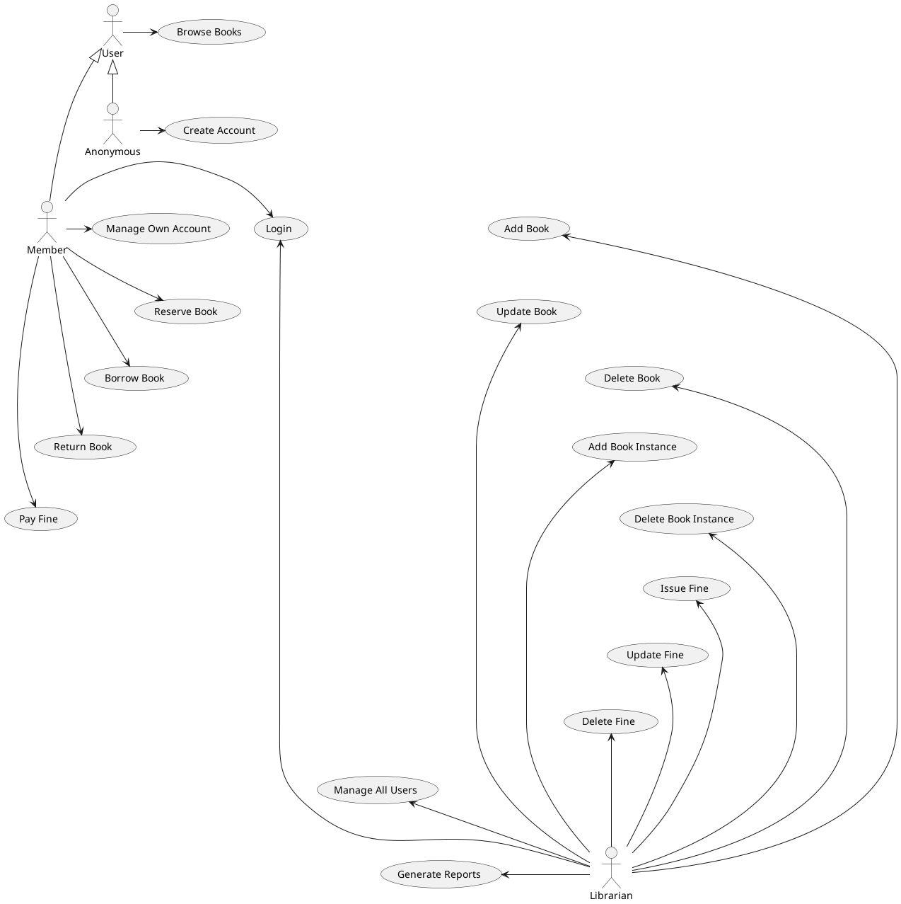
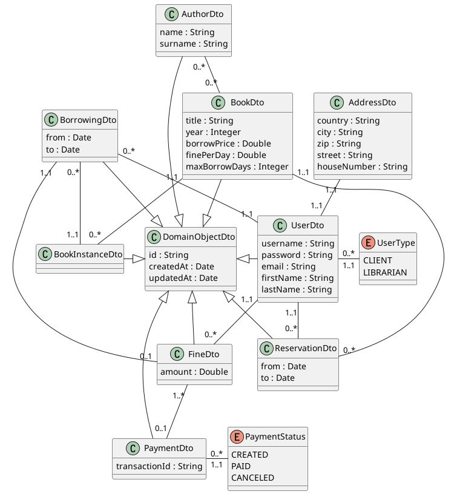

# Library Management System

The Library Management System aims to provide a platform for managing library
resources and services.
The system allows users to access the library's resources online, search for
books, reserve books, borrow and return books, and manage their accounts.

The system has two types of users: the librarian and the members.
The librarian is responsible for managing the library resources, adding new
books, updating book information and managing user accounts.

The members can search for books, reserve books, borrow and return books, and
manage their accounts.
Each borrow has a price and a limit in days for returning, and if this limit is
not kept, there is a configurable fine for each delayed day.

Anonymous users can only list and search books, but cannot reserve or borrow
books without having an account.

## Project Members

- Juraj Marcin - Team Leader
- Marek Fiala
- Marek Miček
- Peter Rúček

## Executable Modules

- library-management
- payment-gate
- reporting
- self-service-kiosk
- oauth2-client

## Running with Podman Compose

To build the containers you can simply run:

```shell
podman-compose build
```

or build using your favourite container build tool (the `podman-compose.yml`
uses `quay.io/juraj_marcin/pa165-library-management-system` as image)

```shell
buildah build -t quay.io/juraj_marcin/pa165-library-management-system
```

Then you can start all services with (use `-d` to run detached):

```shell
podman-compose up [-d]
```

Services can afterwards stopped with

```shell
podman-compose down
```

or by sending a `SIGINT` signal to the services running in foreground (not
detached).

### Default ports

|                    | Port |
|--------------------|------|
| library-management | 8090 |
| payment-gate       | 8081 |
| reporting          | 8082 |
| self-service-kiosk | 8083 |
| oauth2-client      | 8080 |
| Prometheu          | 9090 |
| Grafana            | 3000 |

## Oauth2

To access the API, you need to obtain an access token from the oauth2 server.
One way of getting the token is by using the oauth2-client on port 8080: 
http://localhost:8080/ where you log in to MUNI and after a successful login 
you receive the bearer token (on the page and in the console), 
which needs to be attached to the query 
(`'Authorization': f'Bearer {authorization_token}'`).

But for convenience use the Swagger UI on port 8090: 
http://localhost:8090/swagger-ui.html#/ where you can be authorized by the 
button in the top right corner, and then you can either pass the previously 
obtained bearer token or you log in via the `client_id` and `client_secret` 
where the token is obtained automatically.

## Access monitoring metrics of all services with Grafana dashboard

Monitoring dashboard can be accessed using this address: http://localhost:3000/.
To access grafana dashboard fill use the username `admin` and the password
`admin`.

## Seeding the database

To seed the in-memory database, send `POST` request with empty body to `/seed`.
Sending a `DELETE` request to `/seed` will drop the in-memory database.

## Demo Scenarios

See [scenarios/README.md](scenarios/README.md) for setup.

### Tested cases

The demo tests various combinations of operations from this list

- find by id (user, book, author, borrowing, reservation, fine, payment)
- list all (users, books, authors, borrowings, reservations, fines, payments)
- invalid deletions
- new borrowing, update borrowing
- new reservation, update reservation, delete reservation
- new author, update author
- new book, update book
- new fine, update fine

### Goal

The goal is to have no failures and keep the average response time of the
service under 100 ms.

## Use Case Diagram



## DTO Class Diagram


