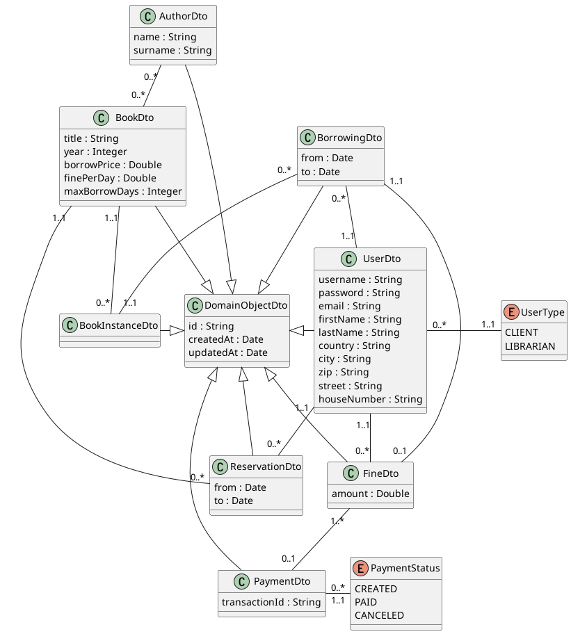

# Library Management System

The Library Management System aims to provide a platform for managing library
resources and services.
The system allows users to access the library's resources online, search for
books, reserve books, borrow and return books, and manage their accounts.

The system has two types of users: the librarian and the members.
The librarian is responsible for managing the library resources, adding new
books, updating book information and managing user accounts.

The members can search for books, reserve books, borrow and return books, and
manage their accounts.
Each borrow has a price and a limit in days for returning, and if this limit is
not kept, there is a configurable fine for each delayed day.

Anonymous users can only list and search books, but cannot reserve or borrow
books without having an account.

## Project Members

- Juraj Marcin - Team Leader
- Marek Fiala
- Marek Miček
- Peter Rúček

## Executable Modules

- library-management
- payment-gate
- reporting
- self-service-kiosk

## Use Case Diagram

## DTO Class Diagram

